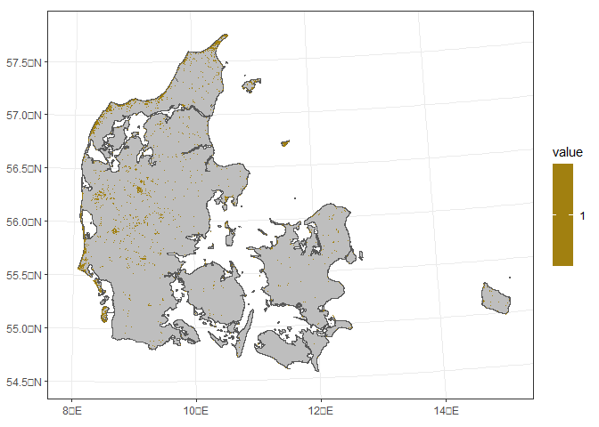
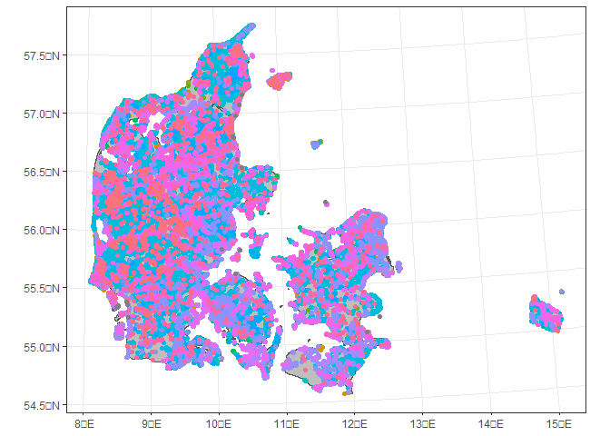
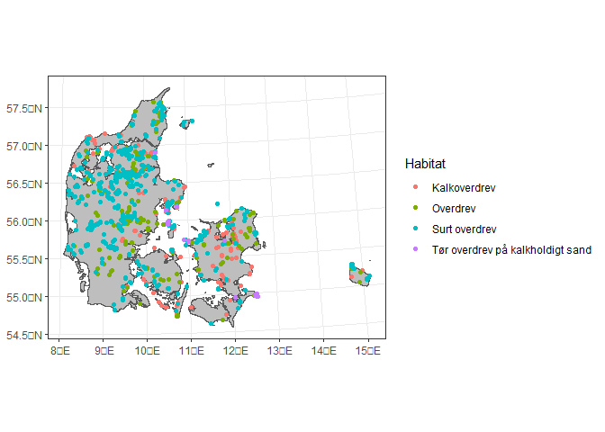

<!-- README.md is generated from README.Rmd. Please edit that file -->

# Ecogenetics_Site_Selection

<!-- badges: start -->
<!-- badges: end -->

The goal of Ecogenetics_Site_Selection is to select the sites for the
ecogenetics field design, here we will reproduce the Summary_2500.rds
and Summary_2500.rds and CandidatesDryCont_2500.rds that are used in the
`Site_Selection_Site.Rmd` and `Site_Selection_Pres.Rmd`, and build in
the `Template.R` script

## Pacakges needed

First we will load the needed packages that are needed:

``` r
library(sf)
library(terra)
library(tidyverse)
library(tidyterra)
library(terra)
library(foreign)
library(raster)
library(maptools)
library(geodata)
```

## Get the dry nature

First we read basemap, and we only use the codes that are considered to
be dry-nature

``` r
basemap <- terra::rast("O:/Nat_Sustain-proj/_user/HanneNicolaisen_au704629/Data/Land_cover_maps/Basemap/Basemap03_public_geotiff/basemap03_2011_2016_2018/lu_agg_2018.tif")
rat <- read.dbf("O:/Nat_Sustain-proj/_user/HanneNicolaisen_au704629/Data/Land_cover_maps/Basemap/Basemap03_public_geotiff/basemap03_2018/lu_00_2018.tif.vat.dbf")


rcl_d <- c(110000, NA,
           121000, NA,
           121110, NA,
           122000, NA,
           122110, NA,
           123000, NA,
           123110, NA,
           124000, NA,
           124110, NA,
           125000, NA,
           125110, NA,
           126000, NA,
           126110, NA,
           130000, NA,
           130110, NA,
           141000, NA,
           142000, NA,
           150000, NA,
           150110, NA,
           160000, NA,
           211000, NA,
           212000, NA,
           220000, NA,
           230000, NA,
           311000, NA,
           312000, NA,
           321000, 1,
           321220, 1,
           322000, NA,
           322220, NA,
           411000, NA,
           412000, NA,
           420000, NA,
           800000, NA,
           999999, NA)

rclmat_d <- matrix(rcl_d, ncol=2, byrow=TRUE)
basemap_d<- classify(basemap,rclmat_d)
terra::writeRaster(basemap_d, "basemap_d.tif")
```

and we will get a polygon of Denmark for further plots

``` r
basemap_d <- terra::rast("basemap_d.tif")
DK <- geodata::gadm(country = "Denmark", level = 0, path = getwd(), version = "4.0") %>%
  terra::project(terra::crs(basemap_d))
```

Here we can see were dry nature currently is in Denmark

``` r
basemap_d <- terra::rast("basemap_d.tif")
ggplot() + 
  geom_spatvector(data = DK, fill = "grey") + 
  geom_spatraster(data = basemap_d) + theme_bw() +
  tidyterra::scale_fill_hypso_c()
#> SpatRaster resampled to ncells = 500703
```

<!-- -->

## Get all potential plots:

``` r
basemap_d <- terra::rast("basemap_d.tif")
NOVANAAndP3_tozsofia <- read_delim("O:/Nat_Sustain-proj/_user/ZsofiaKoma_au700510/forArchiving/FeasStudy/processing/field/novana/NOVANAAndP3_tozsofia/NOVANAAndP3_tozsofia.tsv",
                                   delim = "\t", escape_double = FALSE,
                                   trim_ws = TRUE)
#> Rows: 5292804 Columns: 21
#> ── Column specification ────────────────────────────────────────────────────────
#> Delimiter: "\t"
#> chr  (5): ProgNavn, LatArt, DelAktNavn, Objekt_id, Habitat
#> dbl (16): ProgID, AktID, Plot5mID, Plot15mID, ArtID, TaxonomiID, DelAktID, S...
#> 
#> ℹ Use `spec()` to retrieve the full column specification for this data.
#> ℹ Specify the column types or set `show_col_types = FALSE` to quiet this message.


Novana_plots <- read_sf("O:/Nat_Sustain-proj/_user/ZsofiaKoma_au700510/forArchiving/FeasStudy/processing/field/novana/NOVANAAndP3_tozsofia/Novana_plots_utm.shp")


Biow_plots <- read_sf("O:/Nat_Sustain-proj/_user/ZsofiaKoma_au700510/forArchiving/FeasStudy/processing/field/novana/NOVANAAndP3_tozsofia/data_plot_forshp_biow_utm.shp")


AllPlots <- st_join(Novana_plots,Biow_plots, suffix=c("",".y")) %>%
  mutate(Habitat = case_when(is.na(Habitat) ~ Habitat.y,
                             !is.na(Habitat) ~ Habitat.y),
         HabitatID = case_when(is.na(HabitatID) ~ HabitatID.y,
                             !is.na(HabitatID) ~ HabitatID.y)) %>%
  dplyr::select(-ends_with(".y")) %>%
  vect() %>%
  terra::project(terra::crs(basemap_d))

terra::writeVector(AllPlots, "AllPlots.shp")
```

as an example we can see the habitat type

<!-- -->

## Find candidate plots

We now find only the plots that are part over what basemap considers to
be dry nature:

``` r
AllPlots <- terra::vect("AllPlots.shp")
basemap_d <- terra::rast("basemap_d.tif")
Green <-  basemap_d %>% terra::extract(AllPlots) %>% pull(C_01)
Green <- !is.na(Green)

DryNaturePlot <- AllPlots[Green,]

DryNaturePlot <-  DryNaturePlot[DryNaturePlot$Habitat %in% c("Kalkoverdrev",
"Overdrev",
"Surt overdrev",
"Tør overdrev på kalkholdigt sand"),]
terra::writeVector(DryNaturePlot, "DryNaturePlot.shp")
```

This reduces our universe from 100,594 to 2,385, those plots are shown
in the following map:

<!-- -->
